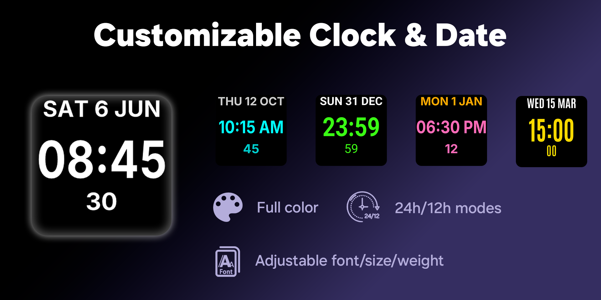
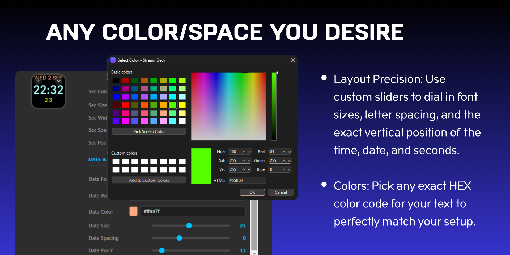
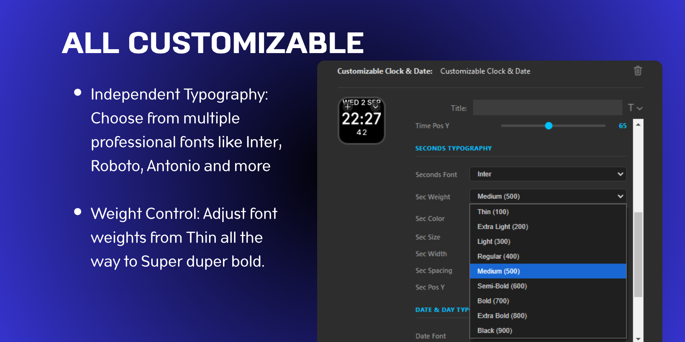
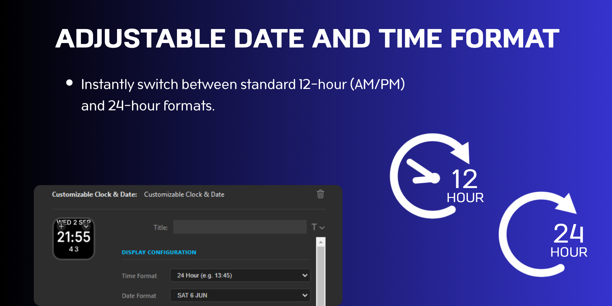
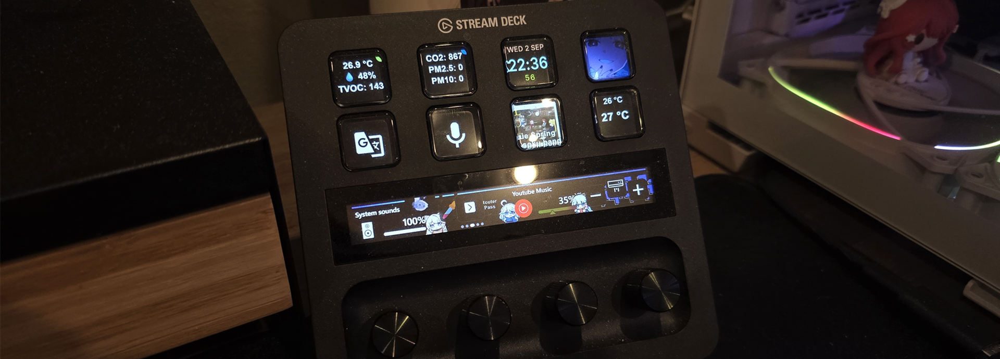
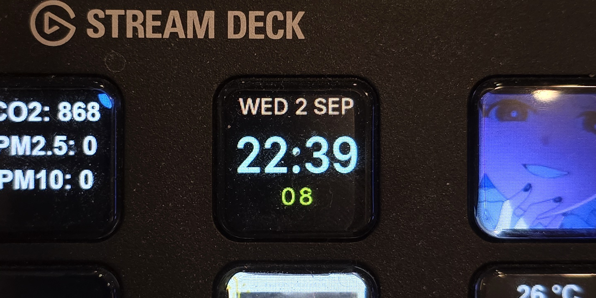

  
  
  # Customizable Clock & Date for Stream Deck

  **An ultra-lightweight, native C# digital clock widget giving you perfect granular control over your Stream Deck typography and aesthetics.**

  

 

### 📸 Beautiful Configurations

  
    
  
    
  

### 📸 Real Life Setup

  
    
  

## ✨ Features

* **Incredibly Lightweight:** Built natively in C# to use practically zero RAM and CPU in the background. Keep your PC resources totally free for gaming and streaming!
* **Independent Typography:** Choose from professional bundled fonts like *Inter*, *Roboto*, *Antonio*, and *Michroma*.
* **Weight Control:** Adjust your font weights from Thin (100) all the way up to Black (900).
* **Format Flexibility:** Instantly switch between standard 12-hour (AM/PM) and 24-hour time formats.
* **Layout Precision:** Granularly dial in font sizes, letter spacing, and the vertical positioning of the time, date, and seconds!
* **Custom Colors:** Pick any exact HEX color code to match your setup perfectly.

## 🚀 Installation & Usage

1. **Download:** Get the plugin directly from the [Elgato Marketplace](https://marketplace.elgato.com/product/customizable-clock-date-b0c60fce-b882-485a-9c8c-b9553faed850).
2. **Add to Canvas:** Drag the "Customizable Clock & Date" action onto your Stream Deck.
3. **Customize:** Click the widget to open the Property Inspector at the bottom of your screen and start tweaking colors, fonts, and layouts!

## 🛠 Contributing

Found a bug or want a new feature? Feel free to open an issue or submit a pull request!
